# Windows通过VNC或SSH远程登录Mac

## 一.Windows通过VNC访问Mac共享屏幕

Mac上的屏幕共享使用的是**_VNC_**（VirtualNetwork Computer，虚拟网络计算机）协议，这种虚拟屏幕协议是支持跨平台的，也就是说你在 iPad, iPhone, Android, Linux甚至 Windows都可以访问到Mac共享的屏幕，当然这都需要分享Mac打开VNC服务，连接方则需要一个VNC客户端。

OS X 10.8之后允许多人（VNC客户端）访问同一个Mac机器（VNC服务器）的屏幕画面。

### **1 Mac打开**[**屏幕共享**](http://www.sdifenzhou.com/1436.html)**服务**

在Mac【系统偏好设置】中选择\[共享\]打开\[屏幕共享\]服务，即可允许其他电脑的用户远程查看并控制此电脑。

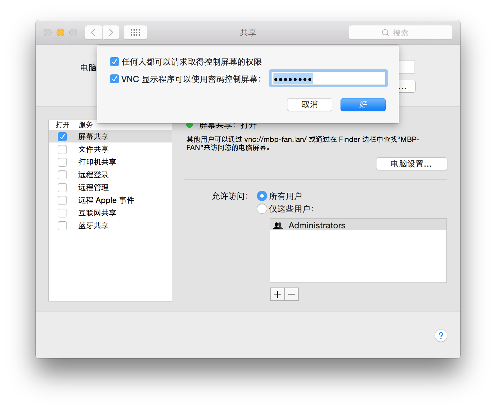

这里设置VNC Viewer使用密码控制屏幕。

**2 Mac****连接共享屏幕**

其他Mac用户在 Finder 菜单中依次选择“前往”>“连接服务器”，输入“vnc://\[IPAddress\]”（例如 vnc://192.168.199.174）或“vnc://\[Name.Domain\]”（例如 vnc://mbp-fan.lan/）即可连接查看或控制局域网中另一台 MAC 主机（屏幕）。或在 Finder 边栏中查找自动发现的局域网分享的主机“MBP-FAN”点击连接来访问。

可参考《[macOS Sierra: 设置和使用屏幕共享](https://support.apple.com/kb/PH25554?viewlocale=zh_CN&locale=el_GR)》和《[设置和使用屏幕共享](https://support.apple.com/zh-cn/guide/mac-help/mh11848/mac)》专题。

### **3** [**WinPC连接Mac共享屏幕**](http://liwpk.blog.163.com/blog/static/36326170201211362549586/)

在WinPC上下载并安装[TightVNC](http://www.tightvnc.com/download.php)软件，默认典型安装TightVNC Viewer客户端和TightVNC Server服务端。

安装完成后，运行TightVNC Viewer, 在New TightVNC Connection对话框的**Remote Host**中输入Mac机的IP地址（192.168.199.174），然后Connect。

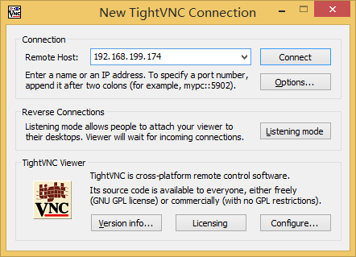

在弹出的Vnc Authentication对话框中输入Mac屏幕共享-电脑设置中设置的屏幕控制密码，即可连接上Mac屏幕。

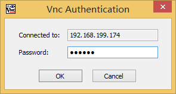

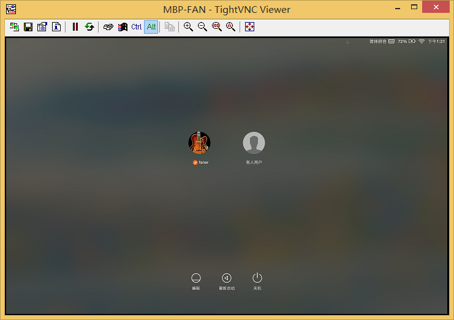  

点击OS X账户（faner）进行登录。  

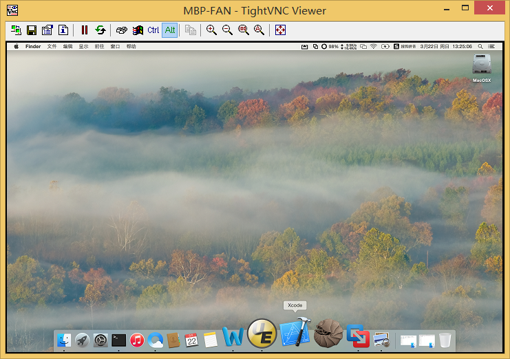  

当然，除了也可以使用第三方基于C/S架构的替代解决方案，例如全平台跨屏解决方案[iTeleport](http://www.iteleportmobile.com/start)——VNC & RDP for Mac and JaaduVNC for iPhone/iPad。

在iPhone上安装“Jaadu VNC”可以远程运行VNC服务器的PC（Windows/Mac）。

### 4 [Apple Remote Desktop](http://www.apple.com/cn/support/remotedesktop/)

在Mac【系统偏好设置】中选择\[共享\]打开\[远程管理\]服务，即可允许其他Mac用户使用 Apple Remote Desktop 访问这台电脑。

Apple Remote Desktop是苹果官方出品的远程桌面管理工具，是针对Mac系统的远程工具，具有服务端和客户端，支持远程安装软件、资源管理和远程协助，可以说是Mac系统间远程管理的最佳工具。使用“帐幕模式”控制最终用户的系统时，可避免最终用户看到屏幕。

Apple Remote Desktop也是VNC-based，因此可以控制支持VNC的电脑，包括[Windows](http://www.macx.cn/thread-823752-1-1.html)、Linux和UNIX系统。Apple Remote Desktop非常适合大型 Macintosh 客户端群组的维护管理。

  

## 二.Windows通过SSH远程登录Mac

**_SSH_**（Secure Shell，安全外壳协议）是一种在不安全网络上提供安全远程登录及其它安全网络服务的协议。

SFTP（Secure FileTransfer Protocol）为 SSH的一部份，是一种传输档案至 Blogger 伺服器的安全方式。由于这种传输方式使用了加密/解密技术，所以传输效率比普通的FTP要低得多，如果您对网络安全性要求更高时，可以使用SFTP代替FTP。

### **1 Mac打开远程登录服务**

在Mac【系统偏好设置】中选择\[共享\]打开\[远程登录\]服务，即可允许在其他电脑上的用户使用SSH或SFTP客户端访问这台电脑。

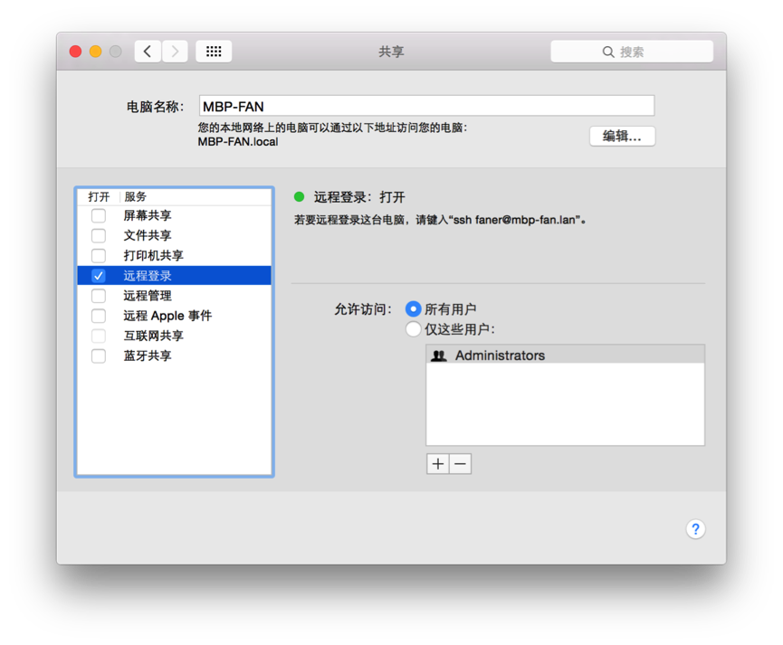

  

  

### **2 SSH客户端远程登录Mac**

在SSH客户端（SecureCRT）中建立会话，Hostname指定上面开启远程登录服务的Mac的IP（192.168.199.174），Username指定Mac上的账户（faner），点击\[Connect\]进行连接（对应命令行为ssh faner@192.168.199.174）：

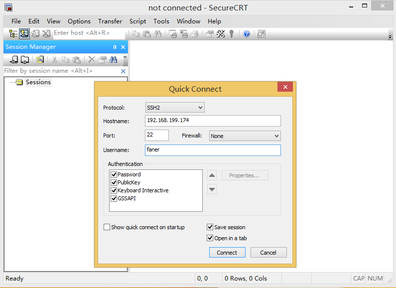

在弹出的“New Host Key'”中选择Accept或者Cancel；在弹出的“Specify public key”中选择“否”。

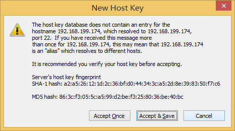

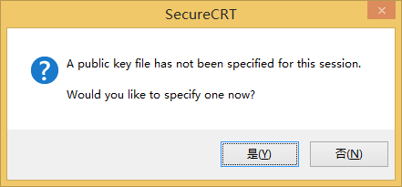

输入Mac账户（faner）的密码，即可连接登录成功。  

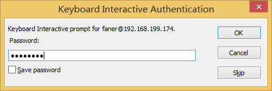  

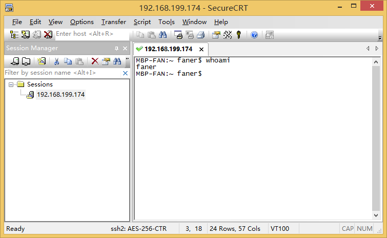