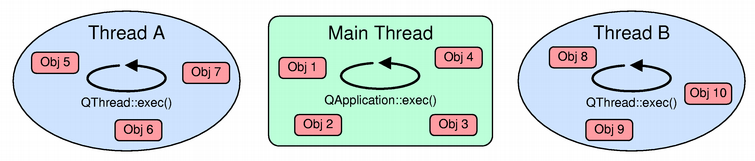

# 先验知识

作为一个非通用的线程编程入门，我们期望你具备一些先验知识：

C++基础知识（尽管大多数建议也适用于其他语言）；
Qt基础：QObjects、信号和槽、事件处理；
什么是线程，线程、进程和操作系统之间的关系是什么；
如何启动和停止线程，以及等待其完成（至少在一个主要操作系统上）；
如何使用互斥锁、信号量和等待条件来创建线程安全/可重入函数、数据结构、类。

在本文档中，我们将遵循Qt的命名约定：

可重入：如果一个类的实例可以从多个线程安全使用，前提是最多有一个线程在同一时间访问同一个实例，则该类是可重入的。如果一个函数可以从多个线程安全调用，前提是每次调用引用的数据都是唯一的，则该函数是可重入的。换句话说，这意味着该类/函数的使用者必须通过某种外部锁定机制来序列化对实例/共享数据的所有访问。

线程安全：如果一个类的实例可以从多个线程同时安全使用，则该类是线程安全的。如果一个函数可以从多个线程同时安全调用，即使调用引用了共享数据，该函数也是线程安全的。

# 事件与事件循环
作为一个事件驱动的工具包，事件和事件传递在Qt架构中扮演着核心角色。在本文中，我们不会全面覆盖这个主题；相反，我们将重点放在一些与线程相关的关键概念上。

Qt中的事件是一个代表应用中发生有趣事情的对象；事件与信号的主要区别在于事件是定向到我们应用中的特定对象（该对象决定如何处理该事件），而信号则是“自由”发出的。从代码的角度来看，所有事件都是QEvent某些子类的实例，并且所有继承自QObject的类都可以重写QObject::event()虚拟方法来处理指向它们实例的事件。

事件既可以由应用程序内部生成，也可以由外部生成；例如：

QKeyEvent和QMouseEvent对象代表某种键盘和鼠标交互，它们来自窗口管理器；
QTimerEvent对象在QObject的一个定时器触发时发送给它，它们通常来自操作系统；
QChildEvent对象在向QObject添加或移除子对象时发送，它们来自你的Qt应用内部。

关于事件的重要一点是，它们不会一生成就被立即交付；而是被排队到事件队列中并在稍后某个时刻发送。分发者自身循环遍历事件队列并将排队的事件发送给它们的目标对象，因此它被称为事件循环。概念上，事件循环看起来像这样（请参阅上面链接的Qt Quarterly文章）：

```cpp
while (is_active)
{
    while (!event*queue*is_empty)
        dispatch*next*event();

    wait*for*more_events();
}
```
我们通过运行QCoreApplication::exec()进入Qt的主事件循环；此调用会阻塞，直到调用QCoreApplication::exit()或QCoreApplication::quit()终止循环。

"wait*for*more_events()"函数会阻塞（即，它不是忙等待），直到某些事件生成。如果我们思考一下，在那个点能生成事件的只剩下外部源（内部事件的分发已经完成，事件队列中没有更多的待处理事件）。因此，事件循环可以通过以下方式唤醒：

窗口管理器活动（按键/鼠标按下、与窗口的交互等）；
套接字活动（有数据可供读取，或套接字在不阻塞的情况下可写，有新的传入连接等）；
计时器（即，定时器触发）；
来自其他线程的事件发布（见下文）。

在类UNIX系统中，窗口管理器活动（即X11）通过套接字（Unix域或TCP/IP）通知应用程序，因为客户端使用它们与X服务器通信。如果我们决定使用内部socketpair(2)实现跨线程事件发布，剩下的只需要响应：

* sockets;
* timers;

而这正是select(2)系统调用所做的：它监视一组描述符的活动，并在一段时间内没有活动时超时（具有可配置的超时）。Qt所需要做的只是将select返回的内容转换为正确的QEvent子类的实例，并将其排队到事件队列中。现在你知道事件循环内部是什么了:)

# What requires a running event loop?

这不是一个详尽的列表，但如果你有了整体概念，你应该能够猜测哪些类需要运行的事件循环。

- 控件绘制和交互： 
当分发QPaintEvent对象时，QWidget::paintEvent()会被调用，这些对象既可以通过调用QWidget::update()（即，内部）生成，也可以由窗口管理器生成（例如，因为隐藏的窗口被显示）。类似的，所有类型的交互（键盘、鼠标等）：相应的事件都需要事件循环来分发。

计时器： 
长话短说，它们是在select(2)或类似调用超时时触发的，因此你需要让Qt为你做这些调用，通过返回事件循环。

网络： 
Qt所有的低级网络类（QTcpSocket, QUdpSocket, QTcpServer等）设计为异步的。当你调用read()时，它们只返回已有的数据；当你调用write()时，它们安排稍后写入。只有当你返回事件循环时，实际的读/写操作才会发生。请注意，它们确实提供了同步方法（waitFor*系列方法），但不鼓励使用它们，因为它们在等待时会阻塞事件循环。高级类，如QNetworkAccessManager，根本就不提供任何同步API，并且要求有事件循环。

# # 阻塞事件循环

在讨论为什么永远不要阻塞事件循环之前，让我们先尝试弄清楚这个“阻塞”意味着什么。假设你有一个按钮控件，当被点击时会发出信号；与此信号相连的是我们Worker对象的一个槽，它要做很多工作。在你点击按钮后，堆栈跟踪看起来像这样（堆栈向下增长）：


* main(int, char )
* QApplication::exec()
* […]
* QWidget::event(QEvent )
* Button::mousePressEvent(QMouseEvent)
* Button::clicked()
* […]
* Worker::doWork()


在main()中，我们通过调用QApplication::exec()（第2行）启动了事件循环。窗口管理器发送了鼠标点击事件，该事件被Qt内核捕获，转换为QMouseEvent，并通过QApplication::notify()（这里未显示）发送给我们的widget的event()方法（第4行）。由于Button没有重写event()，因此调用了基类实现（QWidget）。QWidget::event()检测到事件实际上是鼠标点击，并调用了专门的事件处理程序，即Button::mousePressEvent()（第5行）。我们覆盖了这个方法以发出Button::clicked()信号（第6行），这又调用了我们worker对象的Worker::doWork槽（第7行）。

当worker忙于工作时，事件循环在做什么？你应该已经猜到了：什么也没做！它分派了鼠标按下事件，并阻塞等待事件处理程序返回。我们成功地阻塞了事件循环，这意味着在我们从doWork()槽返回，沿着堆栈，回到事件循环，并让它处理挂起的事件之前，不再发送任何事件。

随着事件分发停滞，控件将无法更新（QPaintEvent对象将停留在队列中），与控件的进一步交互也不再可能（出于相同的原因），计时器不会触发，网络通信也会变慢并停止。此外，许多窗口管理器会检测到你的应用程序不再处理事件，并告诉用户你的应用程序没有响应。这就是为什么快速响应事件并尽快返回事件循环如此重要的原因！

# # 强制事件分发
那么，如果我们有一个长时间的任务要运行并且不想阻塞事件循环，该怎么办呢？一种可能的答案是将任务移到另一个线程中：在接下来的部分中，我们将看到如何实现这一点。我们还有选项手动强制事件循环运行，方法是在我们的阻塞任务内部（重复）调用QCoreApplication::processEvents()。QCoreApplication::processEvents()会处理事件队列中的所有事件，并返回给调用者。

另一个可用的选项是使用QEventLoop类来强制重新进入事件循环。通过调用QEventLoop::exec()，我们重新进入事件循环，并可以将信号连接到QEventLoop::quit()插槽以使其退出。例如：

```cpp
QNetworkAccessManager qnam;
QNetworkReply *reply = qnam.get(QNetworkRequest(QUrl(…)));
QEventLoop loop;
QObject::connect(reply, SIGNAL (finished()), &loop, SLOT (quit()));
loop.exec();
/* reply has finished, use it */
```

QNetworkReply不提供阻塞API，并且需要事件循环正在运行。我们进入一个局部的QEventLoop，当回复完成后，局部事件循环就会退出。

当通过“其他路径”重新进入事件循环时要非常小心：这可能会导致不必要的递归！让我们回到Button示例。如果我们在doWork()插槽内部调用QCoreApplication::processEvents()，并且用户再次点击按钮，doWork()插槽将再次被调用：

```cpp
main(int, char)
QApplication::exec()
//[…]
QWidget::event(QEvent )
Button::mousePressEvent(QMouseEvent)
Button::clicked()
//[…]
Worker::doWork() // first, inner invocation
QCoreApplication::processEvents() // we * manually dispatch events and…
//[…]
QWidget::event(QEvent * ) // another mouse * click is sent to the Button…
Button::mousePressEvent(QMouseEvent *)
Button::clicked() // which emits clicked() * again…
//[…]
Worker::doWork() // DANG! we've recursed into our slot.
```
对此的一个快速简单的解决办法是向QCoreApplication::processEvents()传递*QEventLoop::ExcludeUserInputEvents*，这会告诉事件循环不要分发任何用户输入事件（这些事件将简单地保留在队列中）。

幸运的是，同样的情况并不适用于删除事件（那些由QObject::deleteLater()发布到事件队列中的）。实际上，Qt以特殊的方式处理它们，并且仅在运行的事件循环的“嵌套”程度（关于事件循环）小于调用deleteLater()的事件循环时才进行处理。例如：

```cpp
QObject *object = new QObject;
object->deleteLater();
QDialog dialog;
dialog.exec();
```
不会使object成为一个悬挂指针（由QDialog::exec()进入的事件循环比deleteLater()调用的更“嵌套”）。同样的规则也适用于使用QEventLoop启动的局部事件循环。我发现的这条规则的唯一显著例外（截至Qt 4.7.3）是，如果在没有任何事件循环运行时调用了deleteLater()，那么第一个进入的事件循环将接收该事件并立即删除对象。这是相当合理的，因为Qt不知道任何最终执行删除的“外层”循环，因此立即删除对象。

---

# Qt 线程类
>  计算机是一个状态机。线程是为那些不能编写状态机程序的人准备的。
> —— Alan Cox

Qt多年以来一直支持线程（Qt 2.2版本，发布于2000年9月22日，引入了QThread类），并且在4.0版本中，默认在所有受支持的平台上启用了线程支持（尽管它可以关闭，详情请参见此处）。Qt现在提供了几个用于处理线程的类；让我们从概述开始。

# # QThread
QThread是Qt中线程支持的核心低级别类。一个QThread对象代表一个执行线程。由于Qt的跨平台性质，QThread负责隐藏在不同操作系统上使用线程所需的所有平台特定代码。

为了使用QThread在单独的线程中运行一些代码，我们可以对其进行子类化并覆盖QThread::run()方法：
```cpp
class Thread : public QThread {
protected:
 void run() {
 /* your thread implementation goes here */
 }
};
```
然后我们可以使用

```cpp
Thread *t = new Thread;
t->start(); // start(), not run()!
```
来真正启动新线程。注意，自Qt 4.4起，QThread不再是抽象类；现在虚方法QThread::run()默认简单地调用`QThread::exec();`，这启动了线程的事件循环。

# # QRunnable和QThreadPool
QRunnable是一个轻量级的抽象类，可以用来以“运行并忘记”的方式在另一个线程中启动一个任务。为此，我们所要做的就是子类化QRunnable并实现它的纯虚方法run()：

```cpp
class Task : public QRunnable {
public:
 void run() {
 /* your runnable implementation goes here */
 }
};
```

为了实际运行QRunnable对象，我们使用QThreadPool类，它管理一个线程池。通过调用`QThreadPool::start(runnable)`，我们将一个`QRunnable`放入`QThreadPool`的运行队列中；一旦有线程可用，QRunnable就会被拾取并在那个线程中运行。所有Qt应用程序都可以通过调用`QThreadPool::globalInstance()`获得全局线程池，但也可以始终创建一个私有的QThreadPool实例并显式管理它。

请注意，由于`QRunnable`不是`QObject`，它没有内置的手段显式与其他组件通信；你必须自己编码实现，使用低级别的线程原语（比如一个互斥锁保护的结果收集队列等）。

# # QtConcurrent
QtConcurrent是一个建立在QThreadPool之上的更高级别的API，用于处理最常见的并行计算模式：映射、归约和过滤；它还提供了QtConcurrent::run()方法，可以轻松地在另一个线程中运行函数。

与QThread和QRunnable不同，QtConcurrent不需要我们使用低级同步原语：所有QtConcurrent方法都返回一个QFuture对象，可以用来查询计算状态（其进度），暂停/恢复/取消计算，并且还包含其结果。QFutureWatcher类可以用来监控QFuture的进度并通过信号和槽与其交互（注意QFuture是一个基于值的类，不继承自QObject）。

特性比较

| Feature / API | QThread | QRunnable | QtConcurrent[1] |
|---------------|---------|-----------|-----------------|
| High-level API | × | × | √ |
| Task-oriented | × | √ | √ |
| Built-in support for pause/resume/cancel | × | × | √ |
| Can run at different priorities | √ | × | × |
| Can run event loop | √ | × | × |

# # 线程和QObjects

## # QThread 的事件循环
到目前为止，我们一直在谈论“事件循环”，某种程度上理所当然地认为Qt应用程序中只有一个事件循环。事实并非如此：QThread对象可以在它们代表的线程中启动线程本地事件循环。因此，我们说主线程事件循环是由调用`main()`并以`QCoreApplication::exec()`启动的那个线程创建的（该调用必须从那个线程发出）。这也就是所谓的GUI线程，因为它是唯一允许进行GUI相关操作的线程。QThread的本地事件循环可以通过调用QThread::exec()（在其run()方法内部）来启动：

```cpp
class Thread : public QThread {
protected:
    void run() {
        /* … initialize … */
        exec();
    }
};
```
正如我们前面提到的，自Qt 4.4起，QThread::run()不再是纯虚方法；相反，它调用QThread::exec()。与QCoreApplication一样，QThread也有QThread::quit()和QThread::exit()方法来停止事件循环。

线程事件循环为该线程中生存的所有QObjects分发事件；这包括，默认情况下，所有在该线程中创建或被转移到该线程的对象（更多关于这一点的信息将在后面说明）。我们也说一个QObject的线程亲和力是某个线程，意味着该对象生存于那个线程中。这适用于在QThread对象构造函数中构建的对象：

```cpp
class MyThread : public QThread
{
public:
 MyThread()
 {
 otherObj = new QObject;
 }

private:
 QObject obj;
 QObject *otherObj;
 QScopedPointer<QObject> yetAnotherObj;
};
```

在我们创建MyThread对象之后，obj、otherObj、yetAnotherObj的线程亲和力是什么？我们必须查看创建它们的线程：是运行MyThread构造函数的线程。因此，这三个对象都不在MyThread线程中生存，而是在创建MyThread实例的线程中生存（顺便说一句，实例本身也在这个线程中）。

我们可以随时通过调用QObject::thread()查询QObject的线程亲和力`affinity`。请注意，在QCoreApplication对象创建之前创建的QObjects没有线程亲和力`affinity`，因此不会为它们进行事件分发（换句话说，QCoreApplication构建了代表主线程的QThread对象）。

理解`QObject`及其所有子类都不是线程安全的（尽管它们可以是可重入的）至关重要；因此，你不能同时从多个线程访问`QObject`，除非你序列化对对象内部数据的所有访问（例如，通过使用互斥锁保护它）。记住，在你从另一个线程访问它时，对象可能正在处理其所在线程的事件循环分发的事件！出于同样的原因，你不能直接从另一个线程删除`QObject`，而必须使用`QObject::deleteLater()`，它会发送一个事件，最终由对象所在的线程来执行删除操作。

此外，`QWidget`及其所有子类以及其它GUI相关的类（甚至非基于`QObject`的类，如`QPixmap`）也不是可重入的：它们只能在GUI线程中使用。

我们可以通过调用`QObject::moveToThread()`改变一个`QObject`的线程亲和性`affinity`；这将改变该对象及其子对象的亲和性`affinity`。由于`QObject`不是线程安全的，我们必须在对象所在的线程中使用它；也就是说，你只能从对象当前所在的线程将其推送到其他线程，而不能从其他线程拉取或移动它们。此外，Qt要求`QObject`的子对象必须生活在父对象所在的同一线程中。这意味着：

你不能对有父对象的`QObject`使用`QObject::moveToThread()`；
你不应该在使用`QThread`对象自身作为其父对象的情况下在`QThread`中创建对象：
```cpp
class Thread : public QThread {
    void run() {
        QObject *obj = new QObject(this); // 错误!
    }
};
```
这是因为`QThread`对象存在于另一个线程中，即它被创建的那个线程。

Qt还要求在代表线程的`QThread`对象被销毁之前，该线程中的所有对象必须被删除；这可以通过在`QThread::run()`方法的栈上创建所有生活在该线程中的对象轻松实现。

## # 线程间的信号和槽

鉴于这些前提，我们如何调用在其他线程中的`QObject`的方法呢？Qt提供了一个非常整洁的解决方案：我们在该线程的事件队列中发布一个事件，该事件的处理将包括调用我们感兴趣的函数（这当然要求该线程有一个正在运行的事件循环）。这一功能是围绕moc提供的方法内省构建的：因此，只有标记有`Q_INVOKABLE`宏的信号、槽和方法可以从其他线程调用。

`QMetaObject::invokeMethod()`静态方法为我们完成了所有工作：

```cpp
QMetaObject::invokeMethod(object, "methodName",
                          Qt::QueuedConnection,
                          Q_ARG(type1, arg1),
                          Q_ARG(type2, arg2));
```
请注意，由于参数需要复制到后台构建的事件中，因此它们的类型需要提供公共构造函数、公共析构函数和公共拷贝构造函数，并且必须使用`qRegisterMetaType()`函数在Qt类型系统中注册。

线程间的信号和槽的工作方式类似。当我们连接一个信号到一个槽时，`QObject::connect`的第五个参数用于指定连接类型：

- `direct connection`直接连接意味着槽总是由发出信号的线程直接调用；
- `queued connection`队列连接意味着在接收者的线程的事件队列中发布一个事件，该事件将被事件循环拾取并导致稍后调用槽；
- `blocking queued connection`阻塞队列连接类似于队列连接，但发送方线程会阻塞，直到事件被接收者所在的线程的事件循环拾取、槽被调用并返回；
- `automatic connection`自动连接（默认）：如果接收者所在的线程与当前线程相同，则使用直接连接；否则，使用队列连接。

在每种情况下，请务必记住发出信号的对象所在的线程是完全无关紧要的！对于自动连接，Qt会查看调用信号的线程，并将其与接收者所在的线程进行比较，以确定应使用哪种连接类型。特别是，当前Qt文档在陈述以下内容时是错误的：

自动连接（默认）：如果发射器和接收者处于同一线程中，其行为与直接连接相同。如果发射器和接收者处于不同线程中，其行为则与队列连接相同。

正确的理解应该是，自动连接依据信号发出时的上下文来决定采用直接连接还是队列连接，关键在于信号发出的环境，而非发射器对象本身所属的线程。

因为发射对象的线程亲和性`affinity`并不重要。例如：

```cpp
class Thread : public QThread
{
 Q_OBJECT

signals:
 void aSignal();

protected:
 void run() {
 emit aSignal();
 }
};

/* … */
Thread thread;
Object obj;
QObject::connect(&thread, SIGNAL (aSignal()), &obj, SLOT (aSlot()));
thread.start();
```

信号`aSignal()`将由新线程（由`Thread`对象表示）发出；因为它不是`Object`对象所在的线程（顺便说一下，这与`Thread`对象所在的线程相同，强调发送方的线程亲和性`affinity`无关紧要），所以将使用队列连接。

另一个常见的陷阱是这样的：

```cpp
class Thread : public QThread
{
 Q_OBJECT

slots:
 void aSlot() {
 /* … */
 }

protected:
 void run() {
 /* … */
 }
};

/* … */
Thread thread;
Object obj;
QObject::connect(&obj, SIGNAL (aSignal()), &thread, SLOT (aSlot()));
thread.start();
obj.emitSignal();
```

当"obj"发出其`aSignal()`信号时，将使用哪种类型的连接？你应该已经猜到了：直接连接。那是因为`Thread`对象生活在发出信号的线程中。在`aSlot()`槽中，我们可能在`run()`方法并发运行时访问某些`Thread`的成员变量：这是灾难的完美配方。

再举一个例子，可能是最重要的一个：

```cpp
class Thread : public QThread
{
 Q_OBJECT

slots:
 void aSlot() {
 /* … */
 }

protected:
 void run() {
 QObject *obj = new Object;
 connect(obj, SIGNAL (aSignal()), this, SLOT (aSlot()));
 /* … */
 }
};
```

在这种情况下，使用了队列连接，因此你需要在`Thread`对象所在的线程中运行事件循环。

你经常在论坛、博客文章等中找到的一个解决方案是在`Thread`构造函数中添加`moveToThread(this)`：

```cpp
class Thread : public QThread {
 Q_OBJECT
public:
 Thread() {
 moveToThread(this); // WRONG
 }

/* … */
};
```

这确实会工作（因为现在`Thread`对象的亲和性改变了），但这是一个非常糟糕的设计。这里错误的是我们误解了线程对象（`QThread`子类）的目的：`QThread`对象不是线程；它们是围绕线程的控制对象，因此意在从另一个线程（通常是它们生活的那个线程）中使用。

实现同样效果的一个好方法是将“工作”部分与“控制器”部分分开，即编写一个`QObject`子类，并使用`QObject::moveToThread()`改变其亲和性：

```cpp
class Worker : public QObject {
    Q_OBJECT
    
public slots:
    void doWork() {
        /* ... */
    }
};

// ...
QThread *thread = new QThread;
Worker *worker = new Worker;
connect(obj, SIGNAL(workReady()), worker, SLOT(doWork()));
worker->moveToThread(thread);
thread->start();
```

## # 应做和不应做的事情

你可以...
- 给`QThread`子类添加信号。这是完全安全的，它们会做“正确的事情”（见上文；发送方的线程亲和性无关紧要）。

你不应该...
- 使用`moveToThread(this)`。
- 强制连接类型：这通常意味着你可能在做错事，比如混淆了`QThread`的控制接口与程序逻辑（应保留在生活在线程中的独立对象中）。
- 给`QThread`子类添加槽：它们将从“错误”的线程调用，即不是`QThread`对象管理的那个线程，而是该对象所在的线程，迫使你指定直接连接和/或使用`moveToThread(this)`。
- 使用`QThread::terminate`。

你绝对不要...
- 当线程仍在运行时终止你的程序。使用`QThread::wait`等待它们终止。
- 在它管理的线程还在运行时销毁`QThread`。如果你想要某种“自我销毁”，可以将`finished()`信号连接到`deleteLater()`插槽。

## # 何时应该使用线程？

当你不得不使用阻塞API时
如果你需要使用不提供非阻塞API的库或其他代码（通过信号和槽、事件或回调等方式），那么为了避免冻结事件循环，唯一的可行解决方案是生成进程或线程。由于创建一个新工作进程、让它完成工作并通信回结果明显比仅仅启动一个线程更复杂和昂贵，因此后者是最常见的选择。

一个这样的API的好例子是地址解析（只是为了告诉你，我们讨论的不仅仅是一些第三方的糟糕API。这是每个C库中都包含的东西），即把主机名转换为地址的过程。这个过程涉及对（通常是远程的）系统的查询——域名系统(DNS)。虽然通常响应几乎是即时的，但远程服务器可能会失败，某些数据包可能会丢失，网络连接可能会断开等等；简而言之，我们可能需要几十秒才能得到查询的回复。

在UNIX系统上可用的唯一标准API是阻塞的（不仅仅是过时的`gethostbyname(3)`，还包括更新更好的`getservbyname(3)`和`getaddrinfo(3)`）。`QHostInfo`，Qt中处理主机名查找的类，使用`QThreadPool`来使查询在后台运行（见这里；如果线程支持被关闭，它会切换回阻塞API）。

## # 简单示例：图像加载与缩放

像`QImageReader`和`QImage`只提供了从设备读取图像或调整图像分辨率到不同大小的阻塞方法。处理非常大的图像时，这些过程可能耗时长达数秒。

## # 当你想利用多CPU提升性能

线程允许你的程序在多处理器系统上发挥优势。每个线程由操作系统独立调度，如果你的应用程序运行在这样的机器上，调度器很可能会同时在不同的处理器上运行每个线程。

例如，考虑一个从一组图像生成缩略图的应用程序。一个固定数量线程的线程池（即每个CPU对应一个线程，参考`QThread::idealThreadCount()`），可以将缩小图像生成缩略图的工作分散到所有线程上，从而几乎线性地随着处理器数量增加而加快速度（为简化起见，我们假设CPU是瓶颈）。

## # 当你不想被其他任务潜在阻塞时

这是一个较为高级的话题，如果你觉得目前难以掌握，可以暂时跳过。一个很好的例子来自`QNetworkAccessManager`在WebKit中的使用。WebKit是一个现代的浏览器引擎，即一组用于布局和显示网页的类。使用WebKit的Qt部件是`QWebView`。

`QNetworkAccessManager`是Qt的一个类，用于处理各种目的的HTTP请求和响应，我们可以认为它是网络浏览器的网络引擎。在Qt 4.8之前，它不使用任何工作线程；所有的网络操作都在`QNetworkAccessManager`及其`QNetworkReply`所处的同一线程中处理。

虽然在网络操作中不使用线程是个好主意，但它也有一个主要缺点：如果不尽快从套接字读取数据，内核缓冲区将会填满，数据包开始丢失，传输速度将显著降低。

套接字活动（即，有数据可从套接字读取）由Qt的事件循环管理。阻塞事件循环将导致传输性能下降，因为没有人会被通知有数据待读取（因此也没有人会去读取它们）。

但什么可能会阻塞事件循环呢？令人遗憾的答案是：WebKit本身！一旦接收到一些数据，WebKit就会开始使用这些数据来布局网页。不幸的是，布局过程相当复杂且开销大，因此它会短暂阻塞事件循环，足以影响正在进行的传输（宽带连接在此处发挥作用，几秒钟内就能填满内核缓冲区）。

简单来说，发生的情况如下：

1. WebKit发出请求；
2. 来自回复的一些数据开始到达；
3. WebKit开始使用传入的数据布局网页，阻塞了事件循环；
4. 没有运行的事件循环，数据由操作系统接收，但`QNetworkAccessManager`的套接字不会读取它们；
5. 内核缓冲区填满，传输速度变慢。

因此，页面整体加载时间因这种自我引发的传输缓慢而恶化。

注意，由于`QNetworkAccessManagers`和`QNetworkReplys`都是`QObject`，它们不是线程安全的，因此你不能简单地将它们移动到另一个线程并继续从你的线程中使用它们，因为它们可能同时被两个线程访问：你的线程和它们所在的线程，由于后者线程的事件循环会向它们分发事件。

自Qt 4.8起，`QNetworkAccessManager`默认在单独的线程中处理HTTP请求，因此无响应的GUI和OS缓冲区过快填满的问题应该得以解决。

## # 何时不应该使用线程？

如果认为需要线程，那么你的进程可能过于庞大。

—— Rob Pike

## # Timers

这是最糟糕的线程滥用形式之一。如果我们需要重复调用一个方法（例如，每秒一次），许多人最终会这样做：

```cpp
// VERY WRONG
while (condition) {
 doWork();
 sleep(1); // this is sleep(3) from the C library
}
```

然后他们发现这会阻塞事件循环，因此决定引入线程：

```cpp
// WRONG
class Thread : public QThread {
protected:
 void run() {
 while (condition) {
 // notice that "condition" may also need volatiness and mutex protection
 // if we modify it from other threads (!)
 doWork();
 sleep(1); // this is QThread::sleep()
 }
 }
};
```

实现相同结果的更好且更简单的方法是使用定时器，即一个超时时间为1秒的`QTimer`对象，并使`执行工作()`方法成为一个槽：

```cpp
class Worker : public QObject
{
 Q_OBJECT

public:
 Worker() {
 connect(&timer, SIGNAL (timeout()), this, SLOT (doWork()));
 timer.start(1000);
 }

private slots:
 void doWork() {
 /* … */
 }

private:
 QTimer timer;
};
```

只要有一个运行的事件循环，`执行工作()`方法就会每隔一秒被调用一次。

## # 网络编程与状态机

在处理网络操作时，一个非常常见的设计模式如下：

```cpp
socket->connect(host);
socket->waitForConnected();
data = getData();
socket->write(data);
socket->waitForBytesWritten();
socket->waitForReadyRead();
socket->read(response);

reply = process(response);
socket->write(reply);
socket->waitForBytesWritten();
/* … and so on … */

```

无需多言，各种`waitFor()`调用会阻塞调用者，不返回事件循环，从而导致UI冻结等问题。值得注意的是，上述代码片段未考虑任何错误处理机制，否则情况将更为复杂。此设计的根本问题在于忽视了网络通信本质上是异步的，若围绕其构建同步处理逻辑，则会自找麻烦。为解决这一问题，很多人直接将这部分代码放入单独的线程中执行。

另一个更为抽象的例子是：

```cpp
result = process*one*thing();

if (result->something())
 process_this();
else
 process_that();

wait*for*user_input();
input = read*user*input();
process*user*input(input);
/* … */
```

这个例子也基本存在与网络编程示例相同的缺陷。

让我们退一步，从更高的视角审视我们的目标：我们要创建一个状态机，它能根据某种输入做出反应并采取相应行动。以网络编程为例，我们可能希望建立如下的状态转换：

- **空闲 → 连接中**（当调用`connectToHost()`时）
- **连接中 → 已连接**（当`connected()`信号发出时）
- **已连接 → 登录数据发送**（当我们向服务器发送登录数据时）
- **登录数据发送 → 登录成功**（服务器回复ACK）
- **登录数据发送 → 登录错误**（服务器回复NACK）
    * （...等等...）

构建状态机有多种方式（Qt甚至提供了`QStateMachine`类来辅助），最简单的做法是使用枚举（即整型变量）来记录当前状态。我们可以将上述代码片段改写为如下形式：

```cpp
class Object : public QObject
{
 Q_OBJECT

enum State {
 State1, State2, State3 /* and so on */
 };

 State state;

public:
 Object() : state(State1)
 {
 connect(source, SIGNAL (ready()), this, SLOT (doWork()));
 }

private slots:
 void doWork() {
 switch (state) {
 case State1:
 /* … */
 state = State2;
 break;
 case State2:
 /* … */
 state = State3;
 break;
 /* etc. */
 }
 }
};
```

这里的"source"对象及其"ready()"信号可以根据实际需要设定。例如，在网络编程场景中，我们可能希望将套接字的`QAbstractSocket::connected()`信号和`QIODevice::readyRead()`信号连接到我们的槽函数。当然，根据具体情况，我们还可以轻松添加更多槽函数（比如处理由`QAbstractSocket::error()`信号通知的错误情况）。这是一种真正的异步、信号驱动的设计！

## # 可拆分的任务

假设有长时间的计算任务，它不易于被移到其他线程（或者根本无法移动，因为它必须在GUI线程中运行）。如果我们可以将计算任务分割成小块，就可以在每次处理完一块后返回事件循环，让其分发事件，并触发处理下一块的函数。这很容易实现，只需记住队列连接的工作原理：事件被发布到接收对象所在线程的事件循环中；当事件被投递时，相应的槽函数将被调用。

我们可以通过指定`Qt::QueuedConnection`类型，使用`QMetaObject::invokeMethod()`达到同样的效果；这要求方法必须是可调用的，因此它必须是一个槽函数或是被`Q_INVOKABLE`宏标记的函数。如果我们还想向该方法传递参数，这些参数需要在Qt元类型系统中注册，使用`qRegisterMetaType()`函数。以下代码片段展示了这一模式：

```cpp
class Worker : public QObject
{
 Q_OBJECT
public slots:
 void startProcessing()
 {
 processItem(0);
 }

void processItem(int index)
 {
 /* process items[index] … */

 if (index < numberOfItems)
 QMetaObject::invokeMethod(this,
 "processItem",
 Qt::QueuedConnection,
 Q_ARG(int, index + 1));

 }
};
```

由于这里没有涉及线程，暂停、恢复或取消这类计算任务以及收集结果变得相对简单。