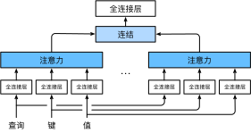

# Multi-Head Attention
:label:`sec_multihead-attention`


In practice,
given the same set of queries, keys, and values
we may want our model to
combine knowledge from
different behaviors of the same attention mechanism,
such as capturing dependencies of various ranges (e.g., shorter-range vs. longer-range)
within a sequence.
Thus, 
it may be beneficial 
to allow our attention mechanism
to jointly use different representation subspaces
of queries, keys, and values.


To this end,
instead of performing a single attention pooling,
queries, keys, and values
can be transformed
with $h$ independently learned linear projections.
Then these $h$ projected queries, keys, and values
are fed into attention pooling in parallel.
In the end,
$h$ attention pooling outputs
are concatenated and 
transformed with another learned linear projection
to produce the final output.
This design
is called *multi-head attention*,
where each of the $h$ attention pooling outputs
is a *head* :cite:`Vaswani.Shazeer.Parmar.ea.2017`.
Using fully-connected layers
to perform learnable linear transformations,
:numref:`fig_multi-head-attention`
describes multi-head attention.


:label:`fig_multi-head-attention`


# # Model

Before providing the implementation of multi-head attention,
let us formalize this model mathematically.
Given a query $\mathbf{q} \in \mathbb{R}^{d_q}$,
a key $\mathbf{k} \in \mathbb{R}^{d_k}$,
and a value $\mathbf{v} \in \mathbb{R}^{d_v}$,
each attention head $\mathbf{h}_i$  ($i = 1, \ldots, h$)
is computed as

$$\mathbf{h}*i = f(\mathbf W*i^{(q)}\mathbf q, \mathbf W*i^{(k)}\mathbf k,\mathbf W*i^{(v)}\mathbf v) \in \mathbb R^{p_v},$$

where learnable parameters
$\mathbf W*i^{(q)}\in\mathbb R^{p*q\times d_q}$,
$\mathbf W*i^{(k)}\in\mathbb R^{p*k\times d_k}$
and $\mathbf W*i^{(v)}\in\mathbb R^{p*v\times d_v}$,
and
$f$ is attention pooling,
such as
additive attention and scaled dot-product attention
in :numref:`sec_attention-scoring-functions`.
The multi-head attention output
is another linear transformation via 
learnable parameters
$\mathbf W*o\in\mathbb R^{p*o\times h p_v}$
of the concatenation of $h$ heads:

$$\mathbf W*o \begin{bmatrix}\mathbf h*1\\\vdots\\\mathbf h*h\end{bmatrix} \in \mathbb{R}^{p*o}.$$

Based on this design,
each head may attend to different parts of the input.
More sophisticated functions than the simple weighted average
can be expressed.

```{.python .input}
from d2l import mxnet as d2l
import math
from mxnet import autograd, np, npx
from mxnet.gluon import nn
npx.set_np()
```

```{.python .input}
# @tab pytorch
from d2l import torch as d2l
import math
import torch
from torch import nn
```

# # Implementation

In our implementation,
we choose the scaled dot-product attention
for each head of the multi-head attention.
To avoid significant growth
of computational cost and parameterization cost,
we set
$p*q = p*k = p*v = p*o / h$.
Note that $h$ heads
can be computed in parallel
if we set
the number of outputs of linear transformations
for the query, key, and value
to $p*q h = p*k h = p*v h = p*o$.
In the following implementation,
$p*o$ is specified via the argument `num*hiddens`.

```{.python .input}
# @save
class MultiHeadAttention(nn.Block):
    def **init**(self, num*hiddens, num*heads, dropout, use_bias=False,
                 **kwargs):
        super(MultiHeadAttention, self).**init**(**kwargs)
        self.num*heads = num*heads
        self.attention = d2l.DotProductAttention(dropout)
        self.W*q = nn.Dense(num*hiddens, use*bias=use*bias, flatten=False)
        self.W*k = nn.Dense(num*hiddens, use*bias=use*bias, flatten=False)
        self.W*v = nn.Dense(num*hiddens, use*bias=use*bias, flatten=False)
        self.W*o = nn.Dense(num*hiddens, use*bias=use*bias, flatten=False)

    def forward(self, queries, keys, values, valid_lens):
        # Shape of `queries`, `keys`, or `values`:
        # (`batch*size`, no. of queries or key-value pairs, `num*hiddens`)
        # Shape of `valid_lens`:
        # (`batch*size`,) or (`batch*size`, no. of queries)
        # After transposing, shape of output `queries`, `keys`, or `values`:
        # (`batch*size` * `num*heads`, no. of queries or key-value pairs,
        # `num*hiddens` / `num*heads`)
        queries = transpose*qkv(self.W*q(queries), self.num_heads)
        keys = transpose*qkv(self.W*k(keys), self.num_heads)
        values = transpose*qkv(self.W*v(values), self.num_heads)

        if valid_lens is not None:
            # On axis 0, copy the first item (scalar or vector) for
            # `num_heads` times, then copy the next item, and so on
            valid*lens = valid*lens.repeat(self.num_heads, axis=0)

        # Shape of `output`: (`batch*size` * `num*heads`, no. of queries,
        # `num*hiddens` / `num*heads`)
        output = self.attention(queries, keys, values, valid_lens)
        
        # Shape of `output_concat`:
        # (`batch*size`, no. of queries, `num*hiddens`)
        output*concat = transpose*output(output, self.num_heads)
        return self.W*o(output*concat)
```

```{.python .input}
# @tab pytorch
# @save
class MultiHeadAttention(nn.Module):
    def **init**(self, key*size, query*size, value*size, num*hiddens,
                 num_heads, dropout, bias=False, **kwargs):
        super(MultiHeadAttention, self).**init**(**kwargs)
        self.num*heads = num*heads
        self.attention = d2l.DotProductAttention(dropout)
        self.W*q = nn.Linear(query*size, num_hiddens, bias=bias)
        self.W*k = nn.Linear(key*size, num_hiddens, bias=bias)
        self.W*v = nn.Linear(value*size, num_hiddens, bias=bias)
        self.W*o = nn.Linear(num*hiddens, num_hiddens, bias=bias)

    def forward(self, queries, keys, values, valid_lens):
        # Shape of `queries`, `keys`, or `values`:
        # (`batch*size`, no. of queries or key-value pairs, `num*hiddens`)
        # Shape of `valid_lens`:
        # (`batch*size`,) or (`batch*size`, no. of queries)
        # After transposing, shape of output `queries`, `keys`, or `values`:
        # (`batch*size` * `num*heads`, no. of queries or key-value pairs,
        # `num*hiddens` / `num*heads`)
        queries = transpose*qkv(self.W*q(queries), self.num_heads)
        keys = transpose*qkv(self.W*k(keys), self.num_heads)
        values = transpose*qkv(self.W*v(values), self.num_heads)

        if valid_lens is not None:
            # On axis 0, copy the first item (scalar or vector) for
            # `num_heads` times, then copy the next item, and so on
            valid*lens = torch.repeat*interleave(
                valid*lens, repeats=self.num*heads, dim=0)

        # Shape of `output`: (`batch*size` * `num*heads`, no. of queries,
        # `num*hiddens` / `num*heads`)
        output = self.attention(queries, keys, values, valid_lens)

        # Shape of `output_concat`:
        # (`batch*size`, no. of queries, `num*hiddens`)
        output*concat = transpose*output(output, self.num_heads)
        return self.W*o(output*concat)
```

To allow for parallel computation of multiple heads,
the above `MultiHeadAttention` class uses two transposition functions as defined below.
Specifically,
the `transpose_output` function reverses the operation
of the `transpose_qkv` function.

```{.python .input}
# @save
def transpose*qkv(X, num*heads):
    # Shape of input `X`:
    # (`batch*size`, no. of queries or key-value pairs, `num*hiddens`).
    # Shape of output `X`:
    # (`batch*size`, no. of queries or key-value pairs, `num*heads`,
    # `num*hiddens` / `num*heads`)
    X = X.reshape(X.shape[0], X.shape[1], num_heads, -1)

    # Shape of output `X`:
    # (`batch*size`, `num*heads`, no. of queries or key-value pairs,
    # `num*hiddens` / `num*heads`)
    X = X.transpose(0, 2, 1, 3)

    # Shape of `output`:
    # (`batch*size` * `num*heads`, no. of queries or key-value pairs,
    # `num*hiddens` / `num*heads`)
    return X.reshape(-1, X.shape[2], X.shape[3])


# @save
def transpose*output(X, num*heads):
    """Reverse the operation of `transpose_qkv`"""
    X = X.reshape(-1, num_heads, X.shape[1], X.shape[2])
    X = X.transpose(0, 2, 1, 3)
    return X.reshape(X.shape[0], X.shape[1], -1)
```

```{.python .input}
# @tab pytorch
# @save
def transpose*qkv(X, num*heads):
    # Shape of input `X`:
    # (`batch*size`, no. of queries or key-value pairs, `num*hiddens`).
    # Shape of output `X`:
    # (`batch*size`, no. of queries or key-value pairs, `num*heads`,
    # `num*hiddens` / `num*heads`)
    X = X.reshape(X.shape[0], X.shape[1], num_heads, -1)

    # Shape of output `X`:
    # (`batch*size`, `num*heads`, no. of queries or key-value pairs,
    # `num*hiddens` / `num*heads`)
    X = X.permute(0, 2, 1, 3)

    # Shape of `output`:
    # (`batch*size` * `num*heads`, no. of queries or key-value pairs,
    # `num*hiddens` / `num*heads`)
    return X.reshape(-1, X.shape[2], X.shape[3])


# @save
def transpose*output(X, num*heads):
    """Reverse the operation of `transpose_qkv`"""
    X = X.reshape(-1, num_heads, X.shape[1], X.shape[2])
    X = X.permute(0, 2, 1, 3)
    return X.reshape(X.shape[0], X.shape[1], -1)
```

Let us test our implemented `MultiHeadAttention` class
using a toy example where keys and values are the same.
As a result,
the shape of the multi-head attention output
is (`batch*size`, `num*queries`, `num_hiddens`).

```{.python .input}
num*hiddens, num*heads = 100, 5
attention = MultiHeadAttention(num*hiddens, num*heads, 0.5)
attention.initialize()
```

```{.python .input}
# @tab pytorch
num*hiddens, num*heads = 100, 5
attention = MultiHeadAttention(num*hiddens, num*hiddens, num_hiddens,
                               num*hiddens, num*heads, 0.5)
attention.eval()
```

```{.python .input}
# @tab all
batch*size, num*queries, num*kvpairs, valid*lens = 2, 4, 6, d2l.tensor([3, 2])
X = d2l.ones((batch*size, num*queries, num_hiddens))
Y = d2l.ones((batch*size, num*kvpairs, num_hiddens))
attention(X, Y, Y, valid_lens).shape
```

# # Summary

* Multi-head attention combines knowledge of the same attention pooling via different representation subspaces of queries, keys, and values.
* To compute multiple heads of multi-head attention in parallel, proper tensor manipulation is needed.


# # Exercises

1. Visualize attention weights of multiple heads in this experiment.
1. Suppose that we have a trained model based on multi-head attention and we want to prune least important attention heads to increase the prediction speed. How can we design experiments to measure the importance of an attention head?


:begin_tab:`mxnet`
[Discussions](https://discuss.d2l.ai/t/1634)
:end_tab:

:begin_tab:`pytorch`
[Discussions](https://discuss.d2l.ai/t/1635)
:end_tab:
