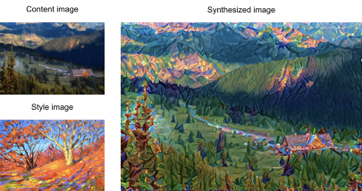
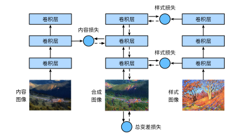

# Neural Style Transfer

If you are a photography enthusiast, 
you may be familiar with the filter.
It can change the color style of photos 
so that landscape photos become sharper
or portrait photos have whitened skins.
However,
one filter usually only changes
one aspect of the photo. 
To apply an ideal style
to a photo,
you probably need to 
try many different filter combinations.
This process is
as complex as tuning the hyperparameters of a model.


In this section, we will
leverage layerwise representations of a CNN
to automatically apply the style of one image
to another image, i.e., *style transfer* :cite:`Gatys.Ecker.Bethge.2016`.
This task needs two input images:
one is the *content image* and
the other is the *style image*.
We will use neural networks
to modify the content image
to make it close to the style image in style.
For example,
the content image in :numref:`fig*style*transfer` is a landscape photo taken by us
in Mount Rainier National Park in the suburbs of Seattle, while the style image is an oil painting
with the theme of autumn oak trees.
In the output synthesized image,
the oil brush strokes of the style image
are applied, leading to more vivid colors,
while preserving the main shape of the objects
in the content image.


:label:`fig*style*transfer`

# # Method

:numref:`fig*style*transfer_model` illustrates
the CNN-based style transfer method with a simplified example.
First, we initialize the synthesized image,
for example, into the content image. 
This synthesized image is the only variable that needs to be updated during the style transfer process,
i.e., the model parameters to be updated during training. 
Then we choose a pretrained CNN
to extract image features and freeze its
model parameters during training. 
This deep CNN uses multiple layers
to extract
hierarchical features for images.
We can choose the output of some of these layers as content features or style features.
Take :numref:`fig*style*transfer_model` as an example.
The pretrained neural network here has 3 convolutional layers,
where the second layer outputs the content features,
and the first and third layers output the style features. 


:label:`fig*style*transfer_model`

Next, we calculate the loss function of style transfer through forward propagation (direction of solid arrows), and update the model parameters (the synthesized image for output) through backpropagation (direction of dashed arrows).
The loss function commonly used in style transfer consists of three parts:
(i) *content loss* makes the synthesized image and the content image close in content features;
(ii) *style loss* makes the synthesized image and style image close in style features;
and (iii) *total variation loss* helps to reduce the noise in the synthesized image.
Finally, when the model training is over, we output the model parameters of the style transfer to generate
the final synthesized image.


In the following,
we will explain the technical details of style transfer via a concrete experiment.


# # [**Reading the Content and Style Images**]

First, we read the content and style images. 
From their printed coordinate axes,
we can tell that these images have different sizes.

```{.python .input}
%matplotlib inline
from d2l import mxnet as d2l
from mxnet import autograd, gluon, image, init, np, npx
from mxnet.gluon import nn

npx.set_np()

d2l.set_figsize()
content_img = image.imread('../img/rainier.jpg')
d2l.plt.imshow(content_img.asnumpy());
```

```{.python .input}
# @tab pytorch
%matplotlib inline
from d2l import torch as d2l
import torch
import torchvision
from torch import nn

d2l.set_figsize()
content_img = d2l.Image.open('../img/rainier.jpg')
d2l.plt.imshow(content_img);
```

```{.python .input}
style_img = image.imread('../img/autumn-oak.jpg')
d2l.plt.imshow(style_img.asnumpy());
```

```{.python .input}
# @tab pytorch
style_img = d2l.Image.open('../img/autumn-oak.jpg')
d2l.plt.imshow(style_img);
```

# # [**Preprocessing and Postprocessing**]

Below, we define two functions for preprocessing and postprocessing images. 
The `preprocess` function standardizes
each of the three RGB channels of the input image and transforms the results into the CNN input format.
The `postprocess` function restores the pixel values in the output image to their original values before standardization.
Since the image printing function requires that each pixel has a floating point value from 0 to 1,
we replace any value smaller than 0 or greater than 1 with 0 or 1, respectively.

```{.python .input}
rgb_mean = np.array([0.485, 0.456, 0.406])
rgb_std = np.array([0.229, 0.224, 0.225])

def preprocess(img, image_shape):
    img = image.imresize(img, *image_shape)
    img = (img.astype('float32') / 255 - rgb*mean) / rgb*std
    return np.expand_dims(img.transpose(2, 0, 1), axis=0)

def postprocess(img):
    img = img[0].as*in*ctx(rgb_std.ctx)
    return (img.transpose(1, 2, 0) * rgb*std + rgb*mean).clip(0, 1)
```

```{.python .input}
# @tab pytorch
rgb_mean = torch.tensor([0.485, 0.456, 0.406])
rgb_std = torch.tensor([0.229, 0.224, 0.225])

def preprocess(img, image_shape):
    transforms = torchvision.transforms.Compose([
        torchvision.transforms.Resize(image_shape),
        torchvision.transforms.ToTensor(),
        torchvision.transforms.Normalize(mean=rgb*mean, std=rgb*std)])
    return transforms(img).unsqueeze(0)

def postprocess(img):
    img = img[0].to(rgb_std.device)
    img = torch.clamp(img.permute(1, 2, 0) * rgb*std + rgb*mean, 0, 1)
    return torchvision.transforms.ToPILImage()(img.permute(2, 0, 1))
```

# # [**Extracting Features**]

We use the VGG-19 model pretrained on the ImageNet dataset to extract image features :cite:`Gatys.Ecker.Bethge.2016`.

```{.python .input}
pretrained*net = gluon.model*zoo.vision.vgg19(pretrained=True)
```

```{.python .input}
# @tab pytorch
pretrained_net = torchvision.models.vgg19(pretrained=True)
```

In order to extract the content features and style features of the image, we can select the output of certain layers in the VGG network.
Generally speaking, the closer to the input layer, the easier to extract details of the image, and vice versa, the easier to extract the global information of the image. In order to avoid excessively
retaining the details of the content image in the synthesized image,
we choose a VGG layer that is closer to the output as the *content layer* to output the content features of the image.
We also select the output of different VGG layers for extracting local and global style features.
These layers are also called *style layers*.
As mentioned in :numref:`sec_vgg`,
the VGG network uses 5 convolutional blocks.
In the experiment, we choose the last convolutional layer of the fourth convolutional block as the content layer, and the first convolutional layer of each convolutional block as the style layer.
The indices of these layers can be obtained by printing the `pretrained_net` instance.

```{.python .input}
# @tab all
style*layers, content*layers = [0, 5, 10, 19, 28], [25]
```

When extracting features using VGG layers,
we only need to use all those
from the input layer to the content layer or style layer that is closest to the output layer.
Let us construct a new network instance `net`, which only retains all the VGG layers to be
used for feature extraction.

```{.python .input}
net = nn.Sequential()
for i in range(max(content*layers + style*layers) + 1):
    net.add(pretrained_net.features[i])
```

```{.python .input}
# @tab pytorch
net = nn.Sequential(*[pretrained_net.features[i] for i in
                      range(max(content*layers + style*layers) + 1)])
```

Given the input `X`, if we simply invoke
the forward propagation `net(X)`, we can only get the output of the last layer.
Since we also need the outputs of intermediate layers,
we need to perform layer-by-layer computation and keep
the content and style layer outputs.

```{.python .input}
# @tab all
def extract*features(X, content*layers, style_layers):
    contents = []
    styles = []
    for i in range(len(net)):
        X = net[i](X)
        if i in style_layers:
            styles.append(X)
        if i in content_layers:
            contents.append(X)
    return contents, styles
```

Two functions are defined below:
the `get_contents` function extracts content features from the content image,
and the `get_styles` function extracts style features from the style image.
Since there is no need to update the model parameters of the pretrained VGG during training,
we can extract the content and the style features
even before the training starts.
Since the synthesized image 
is a set of model parameters to be updated
for style transfer,
we can only extract the content and style features of the synthesized image by calling the `extract_features` function during training.

```{.python .input}
def get*contents(image*shape, device):
    content*X = preprocess(content*img, image_shape).copyto(device)
    contents*Y, * = extract*features(content*X, content*layers, style*layers)
    return content*X, contents*Y

def get*styles(image*shape, device):
    style*X = preprocess(style*img, image_shape).copyto(device)
    *, styles*Y = extract*features(style*X, content*layers, style*layers)
    return style*X, styles*Y
```

```{.python .input}
# @tab pytorch
def get*contents(image*shape, device):
    content*X = preprocess(content*img, image_shape).to(device)
    contents*Y, * = extract*features(content*X, content*layers, style*layers)
    return content*X, contents*Y

def get*styles(image*shape, device):
    style*X = preprocess(style*img, image_shape).to(device)
    *, styles*Y = extract*features(style*X, content*layers, style*layers)
    return style*X, styles*Y
```

# # [**Defining the Loss Function**]

Now we will describe the loss function for style transfer. The loss function consists of
the content loss, style loss, and total variation loss.

## # Content Loss

Similar to the loss function in linear regression,
the content loss measures the difference
in content features
between the synthesized image and the content image via 
the squared loss function.
The two inputs of the squared loss function
are both
outputs of the content layer computed by the `extract_features` function.

```{.python .input}
def content*loss(Y*hat, Y):
    return np.square(Y_hat - Y).mean()
```

```{.python .input}
# @tab pytorch
def content*loss(Y*hat, Y):
    # We detach the target content from the tree used to dynamically compute
    # the gradient: this is a stated value, not a variable. Otherwise the loss
    # will throw an error.
    return torch.square(Y_hat - Y.detach()).mean()
```

## # Style Loss

Style loss, similar to content loss,
also uses the squared loss function to measure the difference in style between the synthesized image and the style image. 
To express the style output of any style layer,
we first use the `extract_features` function to
compute the style layer output. 
Suppose that the output has 
1 example, $c$ channels, 
height $h$, and width $w$,
we can transform this output into 
matrix $\mathbf{X}$ with $c$ rows and $hw$ columns.
This matrix can be thought of as
the concatenation of 
$c$ vectors $\mathbf{x}*1, \ldots, \mathbf{x}*c$, 
each of which has a length of $hw$. 
Here, vector $\mathbf{x}_i$ represents the style feature of channel $i$. 

In the *Gram matrix* of these vectors $\mathbf{X}\mathbf{X}^\top \in \mathbb{R}^{c \times c}$, element $x*{ij}$ in row $i$ and column $j$ is the inner product of vectors $\mathbf{x}*i$ and $\mathbf{x}_j$.
It represents the correlation of the style features of channels $i$ and $j$. 
We use this Gram matrix to represent the style output of any style layer. 
Note that when the value of $hw$ is larger, 
it likely leads to larger values in the Gram matrix. 
Note also that the height and width of the Gram matrix are both the number of channels $c$. 
To allow style loss not to be affected
by these values,
the `gram` function below divides
the Gram matrix by the number of its elements, i.e., $chw$.

```{.python .input}
# @tab all
def gram(X):
    num_channels, n = X.shape[1], d2l.size(X) // X.shape[1]
    X = d2l.reshape(X, (num_channels, n))
    return d2l.matmul(X, X.T) / (num_channels * n)
```

Obviously,
the two Gram matrix inputs of the squared loss function for style loss are based on 
the style layer outputs for 
the synthesized image and the style image.
It is assumed here that the Gram matrix `gram_Y` based on the style image has been precomputed.

```{.python .input}
def style*loss(Y*hat, gram_Y):
    return np.square(gram(Y*hat) - gram*Y).mean()
```

```{.python .input}
# @tab pytorch
def style*loss(Y*hat, gram_Y):
    return torch.square(gram(Y*hat) - gram*Y.detach()).mean()
```

## # Total Variation Loss

Sometimes, the learned synthesized image
has a lot of high-frequency noise, 
i.e., particularly bright or dark pixels.
One common noise reduction method is 
*total variation denoising*. 
Denote by $x_{i, j}$ the pixel value at coordinate $(i, j)$.
Reducing total variation loss

$$\sum*{i, j} \left|x*{i, j} - x*{i+1, j}\right| + \left|x*{i, j} - x_{i, j+1}\right|$$

makes values of neighboring pixels on the synthesized image closer.

```{.python .input}
# @tab all
def tv*loss(Y*hat):
    return 0.5 * (d2l.abs(Y*hat[:, :, 1:, :] - Y*hat[:, :, :-1, :]).mean() +
                  d2l.abs(Y*hat[:, :, :, 1:] - Y*hat[:, :, :, :-1]).mean())
```

## # Loss Function

[**The loss function of style transfer is the weighted sum of content loss, style loss, and total variation loss**].
By adjusting these weight hyperparameters,
we can balance among
content retention, 
style transfer,
and noise reduction on the synthesized image.

```{.python .input}
# @tab all
content*weight, style*weight, tv_weight = 1, 1e3, 10

def compute*loss(X, contents*Y*hat, styles*Y*hat, contents*Y, styles*Y*gram):
    # Calculate the content, style, and total variance losses respectively
    contents*l = [content*loss(Y*hat, Y) * content*weight for Y_hat, Y in zip(
        contents*Y*hat, contents_Y)]
    styles*l = [style*loss(Y*hat, Y) * style*weight for Y_hat, Y in zip(
        styles*Y*hat, styles*Y*gram)]
    tv*l = tv*loss(X) * tv_weight
    # Add up all the losses
    l = sum(10 * styles*l + contents*l + [tv_l])
    return contents*l, styles*l, tv_l, l
```

# # [**Initializing the Synthesized Image**]

In style transfer,
the synthesized image is the only variable that needs to be updated during training.
Thus, we can define a simple model, `SynthesizedImage`, and treat the synthesized image as the model parameters.
In this model, forward propagation just returns the model parameters.

```{.python .input}
class SynthesizedImage(nn.Block):
    def **init**(self, img_shape, **kwargs):
        super(SynthesizedImage, self).**init**(**kwargs)
        self.weight = self.params.get('weight', shape=img_shape)

    def forward(self):
        return self.weight.data()
```

```{.python .input}
# @tab pytorch
class SynthesizedImage(nn.Module):
    def **init**(self, img_shape, **kwargs):
        super(SynthesizedImage, self).**init**(**kwargs)
        self.weight = nn.Parameter(torch.rand(*img_shape))

    def forward(self):
        return self.weight
```

Next, we define the `get_inits` function.
This function creates a synthesized image model instance and initializes it to the image `X`.
Gram matrices for the style image at various style layers, `styles*Y*gram`, are computed prior to training.

```{.python .input}
def get*inits(X, device, lr, styles*Y):
    gen_img = SynthesizedImage(X.shape)
    gen*img.initialize(init.Constant(X), ctx=device, force*reinit=True)
    trainer = gluon.Trainer(gen*img.collect*params(), 'adam',
                            {'learning_rate': lr})
    styles*Y*gram = [gram(Y) for Y in styles_Y]
    return gen*img(), styles*Y_gram, trainer
```

```{.python .input}
# @tab pytorch
def get*inits(X, device, lr, styles*Y):
    gen_img = SynthesizedImage(X.shape).to(device)
    gen*img.weight.data.copy*(X.data)
    trainer = torch.optim.Adam(gen_img.parameters(), lr=lr)
    styles*Y*gram = [gram(Y) for Y in styles_Y]
    return gen*img(), styles*Y_gram, trainer
```

# # [**Training**]


When training the model for style transfer,
we continuously extract 
content features and style features of the synthesized image, and calculate the loss function.
Below defines the training loop.

```{.python .input}
def train(X, contents*Y, styles*Y, device, lr, num*epochs, lr*decay_epoch):
    X, styles*Y*gram, trainer = get*inits(X, device, lr, styles*Y)
    animator = d2l.Animator(xlabel='epoch', ylabel='loss',
                            xlim=[10, num_epochs], ylim=[0, 20],
                            legend=['content', 'style', 'TV'],
                            ncols=2, figsize=(7, 2.5))
    for epoch in range(num_epochs):
        with autograd.record():
            contents*Y*hat, styles*Y*hat = extract_features(
                X, content*layers, style*layers)
            contents*l, styles*l, tv*l, l = compute*loss(
                X, contents*Y*hat, styles*Y*hat, contents*Y, styles*Y_gram)
        l.backward()
        trainer.step(1)
        if (epoch + 1) % lr*decay*epoch == 0:
            trainer.set*learning*rate(trainer.learning_rate * 0.8)
        if (epoch + 1) % 10 == 0:
            animator.axes[1].imshow(postprocess(X).asnumpy())
            animator.add(epoch + 1, [float(sum(contents_l)),
                                     float(sum(styles*l)), float(tv*l)])
    return X
```

```{.python .input}
# @tab pytorch
def train(X, contents*Y, styles*Y, device, lr, num*epochs, lr*decay_epoch):
    X, styles*Y*gram, trainer = get*inits(X, device, lr, styles*Y)
    scheduler = torch.optim.lr*scheduler.StepLR(trainer, lr*decay_epoch, 0.8)
    animator = d2l.Animator(xlabel='epoch', ylabel='loss',
                            xlim=[10, num_epochs],
                            legend=['content', 'style', 'TV'],
                            ncols=2, figsize=(7, 2.5))
    for epoch in range(num_epochs):
        trainer.zero_grad()
        contents*Y*hat, styles*Y*hat = extract_features(
            X, content*layers, style*layers)
        contents*l, styles*l, tv*l, l = compute*loss(
            X, contents*Y*hat, styles*Y*hat, contents*Y, styles*Y_gram)
        l.backward()
        trainer.step()
        scheduler.step()
        if (epoch + 1) % 10 == 0:
            animator.axes[1].imshow(postprocess(X))
            animator.add(epoch + 1, [float(sum(contents_l)),
                                     float(sum(styles*l)), float(tv*l)])
    return X
```

Now we [**start to train the model**].
We rescale the height and width of the content and style images to 300 by 450 pixels.
We use the content image to initialize the synthesized image.

```{.python .input}
device, image*shape = d2l.try*gpu(), (450, 300)
net.collect*params().reset*ctx(device)
content*X, contents*Y = get*contents(image*shape, device)
*, styles*Y = get*styles(image*shape, device)
output = train(content*X, contents*Y, styles_Y, device, 0.9, 500, 50)
```

```{.python .input}
# @tab pytorch
device, image*shape = d2l.try*gpu(), (300, 450)  # PIL Image (h, w)
net = net.to(device)
content*X, contents*Y = get*contents(image*shape, device)
*, styles*Y = get*styles(image*shape, device)
output = train(content*X, contents*Y, styles_Y, device, 0.3, 500, 50)
```

We can see that the synthesized image
retains the scenery and objects of the content image,
and transfers the color of the style image
at the same time.
For example,
the synthesized image has blocks of color like
those in the style image. 
Some of these blocks even have the subtle texture of brush strokes.


# # Summary

* The loss function commonly used in style transfer consists of three parts: (i) content loss makes the synthesized image and the content image close in content features; (ii) style loss makes the synthesized image and style image close in style features; and (iii) total variation loss helps to reduce the noise in the synthesized image.
* We can use a pretrained CNN to extract image features and minimize the loss function to continuously update the synthesized image as model parameters during training.
* We use Gram matrices to represent the style outputs from the style layers.


# # Exercises

1. How does the output change when you select different content and style layers?
1. Adjust the weight hyperparameters in the loss function. Does the output retain more content or have less noise?
1. Use different content and style images. Can you create more interesting synthesized images?
1. Can we apply style transfer for text? Hint: you may refer to the survey paper by Hu et al. :cite:`Hu.Lee.Aggarwal.ea.2020`.

:begin_tab:`mxnet`
[Discussions](https://discuss.d2l.ai/t/378)
:end_tab:

:begin_tab:`pytorch`
[Discussions](https://discuss.d2l.ai/t/1476)
:end_tab:
