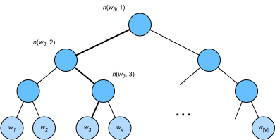

# 近似训练
:label:`sec*approx*train`

回想一下我们在 :numref:`sec*word2vec`中的讨论。跳元模型的主要思想是使用softmax运算来计算基于给定的中心词$w*c$生成上下文字$w*o$的条件概率（如 :eqref:`eq*skip-gram-softmax`），对应的对数损失在 :eqref:`eq_skip-gram-log`给出。

由于softmax操作的性质，上下文词可以是词表$\mathcal{V}$中的任意项， :eqref:`eq*skip-gram-log`包含与整个词表大小一样多的项的求和。因此， :eqref:`eq*skip-gram-grad`中跳元模型的梯度计算和 :eqref:`eq_cbow-gradient`中的连续词袋模型的梯度计算都包含求和。不幸的是，在一个词典上（通常有几十万或数百万个单词）求和的梯度的计算成本是巨大的！

为了降低上述计算复杂度，本节将介绍两种近似训练方法：*负采样*和*分层softmax*。
由于跳元模型和连续词袋模型的相似性，我们将以跳元模型为例来描述这两种近似训练方法。

# # 负采样
:label:`subsec_negative-sampling`

负采样修改了原目标函数。给定中心词$w*c$的上下文窗口，任意上下文词$w*o$来自该上下文窗口的被认为是由下式建模概率的事件：

$$P(D=1\mid w*c, w*o) = \sigma(\mathbf{u}*o^\top \mathbf{v}*c),$$

其中$\sigma$使用了sigmoid激活函数的定义：

$$\sigma(x) = \frac{1}{1+\exp(-x)}.$$
:eqlabel:`eq_sigma-f`

让我们从最大化文本序列中所有这些事件的联合概率开始训练词嵌入。具体而言，给定长度为$T$的文本序列，以$w^{(t)}$表示时间步$t$的词，并使上下文窗口为$m$，考虑最大化联合概率：

$$ \prod*{t=1}^{T} \prod*{-m \leq j \leq m,\ j \neq 0} P(D=1\mid w^{(t)}, w^{(t+j)}).$$
:eqlabel:`eq-negative-sample-pos`

然而， :eqref:`eq-negative-sample-pos`只考虑那些正样本的事件。仅当所有词向量都等于无穷大时， :eqref:`eq-negative-sample-pos`中的联合概率才最大化为1。当然，这样的结果毫无意义。为了使目标函数更有意义，*负采样*添加从预定义分布中采样的负样本。

用$S$表示上下文词$w*o$来自中心词$w*c$的上下文窗口的事件。对于这个涉及$w*o$的事件，从预定义分布$P(w)$中采样$K$个不是来自这个上下文窗口*噪声词*。用$N*k$表示噪声词$w*k$（$k=1, \ldots, K$）不是来自$w*c$的上下文窗口的事件。假设正例和负例$S, N*1, \ldots, N*K$的这些事件是相互独立的。负采样将 :eqref:`eq-negative-sample-pos`中的联合概率（仅涉及正例）重写为

$$ \prod*{t=1}^{T} \prod*{-m \leq j \leq m,\ j \neq 0} P(w^{(t+j)} \mid w^{(t)}),$$

通过事件$S, N*1, \ldots, N*K$近似条件概率：

$$ P(w^{(t+j)} \mid w^{(t)}) =P(D=1\mid w^{(t)}, w^{(t+j)})\prod*{k=1,\ w*k \sim P(w)}^K P(D=0\mid w^{(t)}, w_k).$$
:eqlabel:`eq-negative-sample-conditional-prob`

分别用$i*t$和$h*k$表示词$w^{(t)}$和噪声词$w_k$在文本序列的时间步$t$处的索引。 :eqref:`eq-negative-sample-conditional-prob`中关于条件概率的对数损失为：

$$
\begin{aligned}
-\log P(w^{(t+j)} \mid w^{(t)})
=& -\log P(D=1\mid w^{(t)}, w^{(t+j)}) - \sum*{k=1,\ w*k \sim P(w)}^K \log P(D=0\mid w^{(t)}, w_k)\\
=&-  \log\, \sigma\left(\mathbf{u}*{i*{t+j}}^\top \mathbf{v}*{i*t}\right) - \sum*{k=1,\ w*k \sim P(w)}^K \log\left(1-\sigma\left(\mathbf{u}*{h*k}^\top \mathbf{v}*{i*t}\right)\right)\\
=&-  \log\, \sigma\left(\mathbf{u}*{i*{t+j}}^\top \mathbf{v}*{i*t}\right) - \sum*{k=1,\ w*k \sim P(w)}^K \log\sigma\left(-\mathbf{u}*{h*k}^\top \mathbf{v}*{i*t}\right).
\end{aligned}
$$

我们可以看到，现在每个训练步的梯度计算成本与词表大小无关，而是线性依赖于$K$。当将超参数$K$设置为较小的值时，在负采样的每个训练步处的梯度的计算成本较小。

# # 层序Softmax

作为另一种近似训练方法，*层序Softmax*（hierarchical softmax）使用二叉树（ :numref:`fig*hi*softmax`中说明的数据结构），其中树的每个叶节点表示词表$\mathcal{V}$中的一个词。

:label:`fig*hi*softmax`

用$L(w)$表示二叉树中表示字$w$的从根节点到叶节点的路径上的节点数（包括两端）。设$n(w,j)$为该路径上的$j^\mathrm{th}$节点，其上下文字向量为$\mathbf{u}*{n(w, j)}$。例如， :numref:`fig*hi*softmax`中的$L(w*3) = 4$。分层softmax将 :eqref:`eq_skip-gram-softmax`中的条件概率近似为

$$P(w*o \mid w*c) = \prod*{j=1}^{L(w*o)-1} \sigma\left( [\![  n(w*o, j+1) = \text{leftChild}(n(w*o, j)) ]\!] \cdot \mathbf{u}*{n(w*o, j)}^\top \mathbf{v}_c\right),$$

其中函数$\sigma$在 :eqref:`eq_sigma-f`中定义，$\text{leftChild}(n)$是节点$n$的左子节点：如果$x$为真，$[\![x]\!] = 1$;否则$[\![x]\!] = -1$。

为了说明，让我们计算 :numref:`fig*hi*softmax`中给定词$w*c$生成词$w*3$的条件概率。这需要$w*c$的词向量$\mathbf{v}*c$和从根到$w*3$的路径（ :numref:`fig*hi_softmax`中加粗的路径）上的非叶节点向量之间的点积，该路径依次向左、向右和向左遍历：

$$P(w*3 \mid w*c) = \sigma(\mathbf{u}*{n(w*3, 1)}^\top \mathbf{v}*c) \cdot \sigma(-\mathbf{u}*{n(w*3, 2)}^\top \mathbf{v}*c) \cdot \sigma(\mathbf{u}*{n(w*3, 3)}^\top \mathbf{v}_c).$$

由$\sigma(x)+\sigma(-x) = 1$，它认为基于任意词$w_c$生成词表$\mathcal{V}$中所有词的条件概率总和为1：

$$\sum*{w \in \mathcal{V}} P(w \mid w*c) = 1.$$
:eqlabel:`eq_hi-softmax-sum-one`

幸运的是，由于二叉树结构，$L(w*o)-1$大约与$\mathcal{O}(\text{log}*2|\mathcal{V}|)$是一个数量级。当词表大小$\mathcal{V}$很大时，与没有近似训练的相比，使用分层softmax的每个训练步的计算代价显著降低。

# # 小结

* 负采样通过考虑相互独立的事件来构造损失函数，这些事件同时涉及正例和负例。训练的计算量与每一步的噪声词数成线性关系。
* 分层softmax使用二叉树中从根节点到叶节点的路径构造损失函数。训练的计算成本取决于词表大小的对数。

# # 练习

1. 如何在负采样中对噪声词进行采样？
1. 验证 :eqref:`eq_hi-softmax-sum-one`是否有效。
1. 如何分别使用负采样和分层softmax训练连续词袋模型？

[Discussions](https://discuss.d2l.ai/t/5741)
