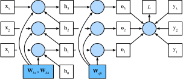

# 通过时间反向传播
:label:`sec_bptt`

到目前为止，我们已经反复提到像*梯度爆炸*或*梯度消失*，
以及需要对循环神经网络*分离梯度*。
例如，在 :numref:`sec*rnn*scratch`中，
我们在序列上调用了`detach`函数。
为了能够快速构建模型并了解其工作原理，
上面所说的这些概念都没有得到充分的解释。
本节将更深入地探讨序列模型反向传播的细节，
以及相关的数学原理。

当我们首次实现循环神经网络（ :numref:`sec*rnn*scratch`）时，
遇到了梯度爆炸的问题。
如果做了练习题，就会发现梯度截断对于确保模型收敛至关重要。
为了更好地理解此问题，本节将回顾序列模型梯度的计算方式，
它的工作原理没有什么新概念，毕竟我们使用的仍然是链式法则来计算梯度。

我们在 :numref:`sec_backprop`中描述了多层感知机中的
前向与反向传播及相关的计算图。
循环神经网络中的前向传播相对简单。
*通过时间反向传播*（backpropagation through time，BPTT）
 :cite:`Werbos.1990`实际上是循环神经网络中反向传播技术的一个特定应用。
它要求我们将循环神经网络的计算图一次展开一个时间步，
以获得模型变量和参数之间的依赖关系。
然后，基于链式法则，应用反向传播来计算和存储梯度。
由于序列可能相当长，因此依赖关系也可能相当长。
例如，某个1000个字符的序列，
其第一个词元可能会对最后位置的词元产生重大影响。
这在计算上是不可行的（它需要的时间和内存都太多了），
并且还需要超过1000个矩阵的乘积才能得到非常难以捉摸的梯度。
这个过程充满了计算与统计的不确定性。
在下文中，我们将阐明会发生什么以及如何在实践中解决它们。

# # 循环神经网络的梯度分析
:label:`subsec*bptt*analysis`

我们从一个描述循环神经网络工作原理的简化模型开始，
此模型忽略了隐状态的特性及其更新方式的细节。
这里的数学表示没有像过去那样明确地区分标量、向量和矩阵，
因为这些细节对于分析并不重要，
反而只会使本小节中的符号变得混乱。

在这个简化模型中，我们将时间步$t$的隐状态表示为$h_t$，
输入表示为$x*t$，输出表示为$o*t$。
回想一下我们在 :numref:`subsec*rnn*w*hidden*states`中的讨论，
输入和隐状态可以拼接后与隐藏层中的一个权重变量相乘。
因此，我们分别使用$w*h$和$w*o$来表示隐藏层和输出层的权重。
每个时间步的隐状态和输出可以写为：

$$\begin{aligned}h*t &= f(x*t, h*{t-1}, w*h),\\o*t &= g(h*t, w_o),\end{aligned}$$
:eqlabel:`eq*bptt*ht_ot`

其中$f$和$g$分别是隐藏层和输出层的变换。
因此，我们有一个链
$\{\ldots, (x*{t-1}, h*{t-1}, o*{t-1}), (x*{t}, h*{t}, o*t), \ldots\}$，
它们通过循环计算彼此依赖。
前向传播相当简单，一次一个时间步的遍历三元组$(x*t, h*t, o_t)$，
然后通过一个目标函数在所有$T$个时间步内
评估输出$o*t$和对应的标签$y*t$之间的差异：

$$L(x*1, \ldots, x*T, y*1, \ldots, y*T, w*h, w*o) = \frac{1}{T}\sum*{t=1}^T l(y*t, o_t).$$

对于反向传播，问题则有点棘手，
特别是当我们计算目标函数$L$关于参数$w_h$的梯度时。
具体来说，按照链式法则：

$$\begin{aligned}\frac{\partial L}{\partial w*h}  & = \frac{1}{T}\sum*{t=1}^T \frac{\partial l(y*t, o*t)}{\partial w*h}  \\& = \frac{1}{T}\sum*{t=1}^T \frac{\partial l(y*t, o*t)}{\partial o*t} \frac{\partial g(h*t, w*o)}{\partial h*t}  \frac{\partial h*t}{\partial w*h}.\end{aligned}$$
:eqlabel:`eq*bptt*partial*L*wh`

在 :eqref:`eq*bptt*partial*L*wh`中乘积的第一项和第二项很容易计算，
而第三项$\partial h*t/\partial w*h$是使事情变得棘手的地方，
因为我们需要循环地计算参数$w*h$对$h*t$的影响。
根据 :eqref:`eq*bptt*ht_ot`中的递归计算，
$h*t$既依赖于$h*{t-1}$又依赖于$w_h$，
其中$h*{t-1}$的计算也依赖于$w*h$。
因此，使用链式法则产生：

$$\frac{\partial h*t}{\partial w*h}= \frac{\partial f(x*{t},h*{t-1},w*h)}{\partial w*h} +\frac{\partial f(x*{t},h*{t-1},w*h)}{\partial h*{t-1}} \frac{\partial h*{t-1}}{\partial w*h}.$$
:eqlabel:`eq*bptt*partial*ht*wh_recur`

为了导出上述梯度，假设我们有三个序列$\{a*{t}\},\{b*{t}\},\{c_{t}\}$，
当$t=1,2,\ldots$时，序列满足$a*{0}=0$且$a*{t}=b*{t}+c*{t}a_{t-1}$。
对于$t\geq 1$，就很容易得出：

$$a*{t}=b*{t}+\sum*{i=1}^{t-1}\left(\prod*{j=i+1}^{t}c*{j}\right)b*{i}.$$
:eqlabel:`eq*bptt*at`

基于下列公式替换$a*t$、$b*t$和$c_t$：

$$\begin{aligned}a*t &= \frac{\partial h*t}{\partial w_h},\\
b*t &= \frac{\partial f(x*{t},h*{t-1},w*h)}{\partial w_h}, \\
c*t &= \frac{\partial f(x*{t},h*{t-1},w*h)}{\partial h_{t-1}},\end{aligned}$$

公式 :eqref:`eq*bptt*partial*ht*wh_recur`中的梯度计算
满足$a*{t}=b*{t}+c*{t}a*{t-1}$。
因此，对于每个 :eqref:`eq*bptt*at`，
我们可以使用下面的公式移除 :eqref:`eq*bptt*partial*ht*wh_recur`中的循环计算

$$\frac{\partial h*t}{\partial w*h}=\frac{\partial f(x*{t},h*{t-1},w*h)}{\partial w*h}+\sum*{i=1}^{t-1}\left(\prod*{j=i+1}^{t} \frac{\partial f(x*{j},h*{j-1},w*h)}{\partial h*{j-1}} \right) \frac{\partial f(x*{i},h*{i-1},w*h)}{\partial w*h}.$$
:eqlabel:`eq*bptt*partial*ht*wh_gen`

虽然我们可以使用链式法则递归地计算$\partial h*t/\partial w*h$，
但当$t$很大时这个链就会变得很长。
我们需要想想办法来处理这一问题.

## # 完全计算 ## #

显然，我们可以仅仅计算 :eqref:`eq*bptt*partial*ht*wh_gen`中的全部总和，
然而，这样的计算非常缓慢，并且可能会发生梯度爆炸，
因为初始条件的微小变化就可能会对结果产生巨大的影响。
也就是说，我们可以观察到类似于蝴蝶效应的现象，
即初始条件的很小变化就会导致结果发生不成比例的变化。
这对于我们想要估计的模型而言是非常不可取的。
毕竟，我们正在寻找的是能够很好地泛化高稳定性模型的估计器。
因此，在实践中，这种方法几乎从未使用过。

## # 截断时间步 ## #

或者，我们可以在$\tau$步后截断
 :eqref:`eq*bptt*partial*ht*wh_gen`中的求和计算。
这是我们到目前为止一直在讨论的内容，
例如在 :numref:`sec*rnn*scratch`中分离梯度时。
这会带来真实梯度的*近似*，
只需将求和终止为$\partial h*{t-\tau}/\partial w*h$。
在实践中，这种方式工作得很好。
它通常被称为截断的通过时间反向传播 :cite:`Jaeger.2002`。
这样做导致该模型主要侧重于短期影响，而不是长期影响。
这在现实中是可取的，因为它会将估计值偏向更简单和更稳定的模型。

## # 随机截断 ## #

最后，我们可以用一个随机变量替换$\partial h*t/\partial w*h$，
该随机变量在预期中是正确的，但是会截断序列。
这个随机变量是通过使用序列$\xi_t$来实现的，
序列预定义了$0 \leq \pi_t \leq 1$，
其中$P(\xi*t = 0) = 1-\pi*t$且$P(\xi*t = \pi*t^{-1}) = \pi_t$，
因此$E[\xi_t] = 1$。
我们使用它来替换 :eqref:`eq*bptt*partial*ht*wh_recur`中的
梯度$\partial h*t/\partial w*h$得到：

$$z*t= \frac{\partial f(x*{t},h*{t-1},w*h)}{\partial w*h} +\xi*t \frac{\partial f(x*{t},h*{t-1},w*h)}{\partial h*{t-1}} \frac{\partial h*{t-1}}{\partial w*h}.$$

从$\xi*t$的定义中推导出来$E[z*t] = \partial h*t/\partial w*h$。
每当$\xi_t = 0$时，递归计算终止在这个$t$时间步。
这导致了不同长度序列的加权和，其中长序列出现的很少，
所以将适当地加大权重。
这个想法是由塔莱克和奥利维尔 :cite:`Tallec.Ollivier.2017`提出的。

## # 比较策略

:label:`fig*truncated*bptt`

 :numref:`fig*truncated*bptt`说明了
当基于循环神经网络使用通过时间反向传播
分析《时间机器》书中前几个字符的三种策略：

* 第一行采用随机截断，方法是将文本划分为不同长度的片断；
* 第二行采用常规截断，方法是将文本分解为相同长度的子序列。
  这也是我们在循环神经网络实验中一直在做的；
* 第三行采用通过时间的完全反向传播，结果是产生了在计算上不可行的表达式。

遗憾的是，虽然随机截断在理论上具有吸引力，
但很可能是由于多种因素在实践中并不比常规截断更好。
首先，在对过去若干个时间步经过反向传播后，
观测结果足以捕获实际的依赖关系。
其次，增加的方差抵消了时间步数越多梯度越精确的事实。
第三，我们真正想要的是只有短范围交互的模型。
因此，模型需要的正是截断的通过时间反向传播方法所具备的轻度正则化效果。

# # 通过时间反向传播的细节

在讨论一般性原则之后，我们看一下通过时间反向传播问题的细节。
与 :numref:`subsec*bptt*analysis`中的分析不同，
下面我们将展示如何计算目标函数相对于所有分解模型参数的梯度。
为了保持简单，我们考虑一个没有偏置参数的循环神经网络，
其在隐藏层中的激活函数使用恒等映射（$\phi(x)=x$）。
对于时间步$t$，设单个样本的输入及其对应的标签分别为
$\mathbf{x}*t \in \mathbb{R}^d$和$y*t$。
计算隐状态$\mathbf{h}_t \in \mathbb{R}^h$和
输出$\mathbf{o}_t \in \mathbb{R}^q$的方式为：

$$\begin{aligned}\mathbf{h}*t &= \mathbf{W}*{hx} \mathbf{x}*t + \mathbf{W}*{hh} \mathbf{h}_{t-1},\\
\mathbf{o}*t &= \mathbf{W}*{qh} \mathbf{h}_{t},\end{aligned}$$

其中权重参数为$\mathbf{W}_{hx} \in \mathbb{R}^{h \times d}$、
$\mathbf{W}_{hh} \in \mathbb{R}^{h \times h}$和
$\mathbf{W}_{qh} \in \mathbb{R}^{q \times h}$。
用$l(\mathbf{o}*t, y*t)$表示时间步$t$处
（即从序列开始起的超过$T$个时间步）的损失函数，
则我们的目标函数的总体损失是：

$$L = \frac{1}{T} \sum*{t=1}^T l(\mathbf{o}*t, y_t).$$

为了在循环神经网络的计算过程中可视化模型变量和参数之间的依赖关系，
我们可以为模型绘制一个计算图，
如 :numref:`fig*rnn*bptt`所示。
例如，时间步3的隐状态$\mathbf{h}_3$的计算
取决于模型参数$\mathbf{W}*{hx}$和$\mathbf{W}*{hh}$，
以及最终时间步的隐状态$\mathbf{h}_2$
以及当前时间步的输入$\mathbf{x}_3$。

:label:`fig*rnn*bptt`

正如刚才所说， :numref:`fig*rnn*bptt`中的模型参数是
$\mathbf{W}*{hx}$、$\mathbf{W}*{hh}$和$\mathbf{W}_{qh}$。
通常，训练该模型需要对这些参数进行梯度计算：
$\partial L/\partial \mathbf{W}_{hx}$、
$\partial L/\partial \mathbf{W}_{hh}$和
$\partial L/\partial \mathbf{W}_{qh}$。
根据 :numref:`fig*rnn*bptt`中的依赖关系，
我们可以沿箭头的相反方向遍历计算图，依次计算和存储梯度。
为了灵活地表示链式法则中不同形状的矩阵、向量和标量的乘法，
我们继续使用如 :numref:`sec_backprop`中
所述的$\text{prod}$运算符。

首先，在任意时间步$t$，
目标函数关于模型输出的微分计算是相当简单的：

$$\frac{\partial L}{\partial \mathbf{o}*t} =  \frac{\partial l (\mathbf{o}*t, y*t)}{T \cdot \partial \mathbf{o}*t} \in \mathbb{R}^q.$$
:eqlabel:`eq*bptt*partial*L*ot`

现在，我们可以计算目标函数关于输出层中参数$\mathbf{W}_{qh}$的梯度：
$\partial L/\partial \mathbf{W}_{qh} \in \mathbb{R}^{q \times h}$。
基于 :numref:`fig*rnn*bptt`，
目标函数$L$通过$\mathbf{o}*1, \ldots, \mathbf{o}*T$
依赖于$\mathbf{W}_{qh}$。
依据链式法则，得到

$$
\frac{\partial L}{\partial \mathbf{W}_{qh}}
= \sum*{t=1}^T \text{prod}\left(\frac{\partial L}{\partial \mathbf{o}*t}, \frac{\partial \mathbf{o}*t}{\partial \mathbf{W}*{qh}}\right)
= \sum*{t=1}^T \frac{\partial L}{\partial \mathbf{o}*t} \mathbf{h}_t^\top,
$$

其中$\partial L/\partial \mathbf{o}_t$是
由 :eqref:`eq*bptt*partial*L*ot`给出的。

接下来，如 :numref:`fig*rnn*bptt`所示，
在最后的时间步$T$，目标函数$L$仅通过$\mathbf{o}_T$
依赖于隐状态$\mathbf{h}_T$。
因此，我们通过使用链式法可以很容易地得到梯度
$\partial L/\partial \mathbf{h}_T \in \mathbb{R}^h$：

$$\frac{\partial L}{\partial \mathbf{h}*T} = \text{prod}\left(\frac{\partial L}{\partial \mathbf{o}*T}, \frac{\partial \mathbf{o}*T}{\partial \mathbf{h}*T} \right) = \mathbf{W}*{qh}^\top \frac{\partial L}{\partial \mathbf{o}*T}.$$
:eqlabel:`eq*bptt*partial*L*hT*final*step`

当目标函数$L$通过$\mathbf{h}*{t+1}$和$\mathbf{o}*t$
依赖$\mathbf{h}_t$时，
对任意时间步$t < T$来说都变得更加棘手。
根据链式法则，隐状态的梯度
$\partial L/\partial \mathbf{h}_t \in \mathbb{R}^h$
在任何时间步骤$t < T$时都可以递归地计算为：

$$\frac{\partial L}{\partial \mathbf{h}*t} = \text{prod}\left(\frac{\partial L}{\partial \mathbf{h}*{t+1}}, \frac{\partial \mathbf{h}*{t+1}}{\partial \mathbf{h}*t} \right) + \text{prod}\left(\frac{\partial L}{\partial \mathbf{o}*t}, \frac{\partial \mathbf{o}*t}{\partial \mathbf{h}*t} \right) = \mathbf{W}*{hh}^\top \frac{\partial L}{\partial \mathbf{h}*{t+1}} + \mathbf{W}*{qh}^\top \frac{\partial L}{\partial \mathbf{o}_t}.$$
:eqlabel:`eq*bptt*partial*L*ht_recur`

为了进行分析，对于任何时间步$1 \leq t \leq T$展开递归计算得

$$\frac{\partial L}{\partial \mathbf{h}*t}= \sum*{i=t}^T {\left(\mathbf{W}*{hh}^\top\right)}^{T-i} \mathbf{W}*{qh}^\top \frac{\partial L}{\partial \mathbf{o}_{T+t-i}}.$$
:eqlabel:`eq*bptt*partial*L*ht`

我们可以从 :eqref:`eq*bptt*partial*L*ht`中看到，
这个简单的线性例子已经展现了长序列模型的一些关键问题：
它陷入到$\mathbf{W}_{hh}^\top$的潜在的非常大的幂。
在这个幂中，小于1的特征值将会消失，大于1的特征值将会发散。
这在数值上是不稳定的，表现形式为梯度消失或梯度爆炸。
解决此问题的一种方法是按照计算方便的需要截断时间步长的尺寸
如 :numref:`subsec*bptt*analysis`中所述。
实际上，这种截断是通过在给定数量的时间步之后分离梯度来实现的。
稍后，我们将学习更复杂的序列模型（如长短期记忆模型）
是如何进一步缓解这一问题的。

最后， :numref:`fig*rnn*bptt`表明：
目标函数$L$通过隐状态$\mathbf{h}*1, \ldots, \mathbf{h}*T$
依赖于隐藏层中的模型参数$\mathbf{W}*{hx}$和$\mathbf{W}*{hh}$。
为了计算有关这些参数的梯度
$\partial L / \partial \mathbf{W}*{hx} \in \mathbb{R}^{h \times d}$和$\partial L / \partial \mathbf{W}*{hh} \in \mathbb{R}^{h \times h}$，
我们应用链式规则得：

$$
\begin{aligned}
\frac{\partial L}{\partial \mathbf{W}_{hx}}
&= \sum*{t=1}^T \text{prod}\left(\frac{\partial L}{\partial \mathbf{h}*t}, \frac{\partial \mathbf{h}*t}{\partial \mathbf{W}*{hx}}\right)
= \sum*{t=1}^T \frac{\partial L}{\partial \mathbf{h}*t} \mathbf{x}_t^\top,\\
\frac{\partial L}{\partial \mathbf{W}_{hh}}
&= \sum*{t=1}^T \text{prod}\left(\frac{\partial L}{\partial \mathbf{h}*t}, \frac{\partial \mathbf{h}*t}{\partial \mathbf{W}*{hh}}\right)
= \sum*{t=1}^T \frac{\partial L}{\partial \mathbf{h}*t} \mathbf{h}_{t-1}^\top,
\end{aligned}
$$

其中$\partial L/\partial \mathbf{h}_t$
是由 :eqref:`eq*bptt*partial*L*hT*final*step`和
 :eqref:`eq*bptt*partial*L*ht_recur`递归计算得到的，
是影响数值稳定性的关键量。

正如我们在 :numref:`sec_backprop`中所解释的那样，
由于通过时间反向传播是反向传播在循环神经网络中的应用方式，
所以训练循环神经网络交替使用前向传播和通过时间反向传播。
通过时间反向传播依次计算并存储上述梯度。
具体而言，存储的中间值会被重复使用，以避免重复计算，
例如存储$\partial L/\partial \mathbf{h}_t$，
以便在计算$\partial L / \partial \mathbf{W}_{hx}$和
$\partial L / \partial \mathbf{W}_{hh}$时使用。

# # 小结

* “通过时间反向传播”仅仅适用于反向传播在具有隐状态的序列模型。
* 截断是计算方便性和数值稳定性的需要。截断包括：规则截断和随机截断。
* 矩阵的高次幂可能导致神经网络特征值的发散或消失，将以梯度爆炸或梯度消失的形式表现。
* 为了计算的效率，“通过时间反向传播”在计算期间会缓存中间值。

# # 练习

1. 假设我们拥有一个对称矩阵$\mathbf{M} \in \mathbb{R}^{n \times n}$，其特征值为$\lambda*i$，对应的特征向量是$\mathbf{v}*i$（$i = 1, \ldots, n$）。通常情况下，假设特征值的序列顺序为$|\lambda*i| \geq |\lambda*{i+1}|$。
   1. 证明$\mathbf{M}^k$拥有特征值$\lambda_i^k$。
   1. 证明对于一个随机向量$\mathbf{x} \in \mathbb{R}^n$，$\mathbf{M}^k \mathbf{x}$将有较高概率与$\mathbf{M}$的特征向量$\mathbf{v}_1$在一条直线上。形式化这个证明过程。
   1. 上述结果对于循环神经网络中的梯度意味着什么？
1. 除了梯度截断，还有其他方法来应对循环神经网络中的梯度爆炸吗？

[Discussions](https://discuss.d2l.ai/t/2107)
